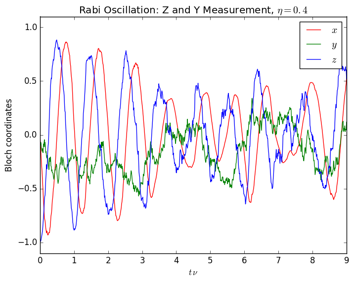
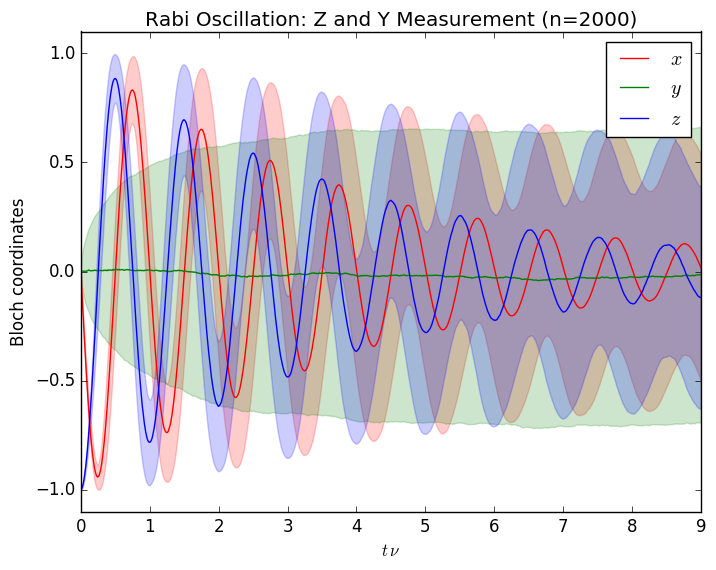

# QuantumBayesian

[](https://travis-ci.org/justindressel/QuantumBayesian)
[](https://codecov.io/gh/justindressel/QuantumBayesian)


Julia package for simulating quantum evolution efficiently, including the quantum Bayesian approach to stochastic measurement update and continuous readout.

# Example
```julia
using QuantumBayesian
using PyPlot

q = qubit()
```

    QuantumBayesian.QFactor: Qubit
    Dims  : 2
    Ops   : "d", "y", "x", "u", "z", "i"

```julia
Ω  = 2*π;        # Rabi frequency
τ = 3.0;         # Measurement collapse timescale
η = 1.0;         # Measurement efficiency
Γ = 1/(2*τ*η);   # Measurement dephasing rate
T = (0.0, 6*τ);  # Time duration of simulation;

dt = 1e-2;       # Simulation timestep (coarse to show method precision)

# Initial condition
init = ground(q)

# Time-dependent Hamiltonian
f(t) = 2*exp(-(t-3*τ)^2/2)/sqrt(2π)
H(t) = f(t)*(Ω/2)*q("y");

# Measurement dephasing
DM = sqrt(Γ/2)*q("z");

# Bloch coordinate expectation values 
fs = collect(ρ -> real(expect(ρ, q(l))) for l in ["x","y","z"])

# Integrate trajectory
trajectory(lind(dt, H, DM), init, T, fs..., dt=dt)
```

    INFO: Trajectory: steps = 1799, points = 1000, values = 3
    INFO: Time elapsed: 0.086969712 s, Steps per second: 20685.362278766657


```julia
ensemble_realization(ymeas=true, η=0.4)
```

    INFO: Trajectory: steps = 899, points = 899, values = 3
    INFO: Readout: values = 2
    INFO: Time elapsed: 0.081660735 s, Steps per second: 11008.962875487221



```julia
ensemble_realization(n=2000, ymeas=true)
```

    INFO: Trajectories: 2000, steps each: 899, points each: 899, values each = 3
    INFO: Readouts: values each = 2
    INFO: Time elapsed: 49.345879942 s, Steps: 1798000, Steps per second: 36436.67925495152



