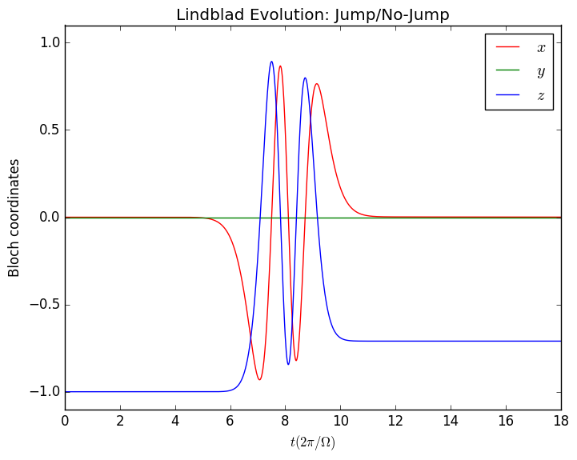
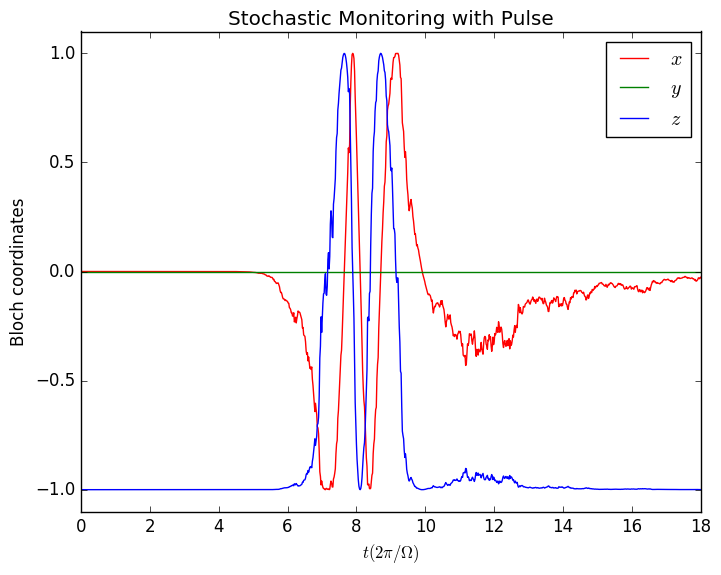
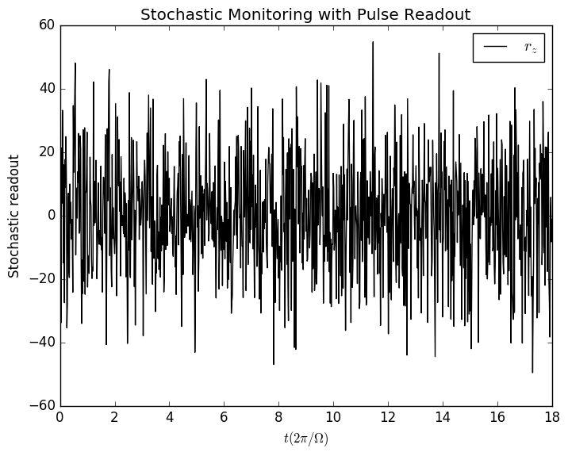
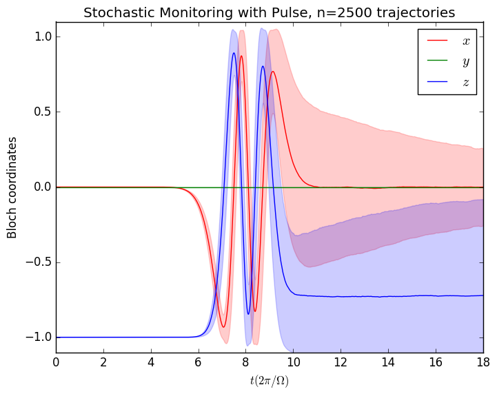
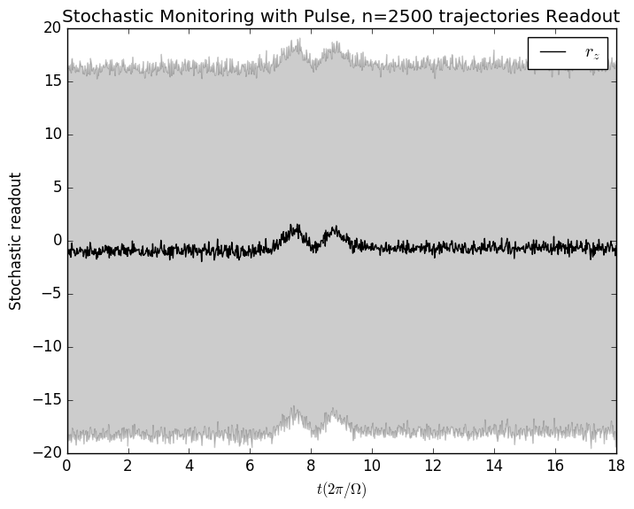
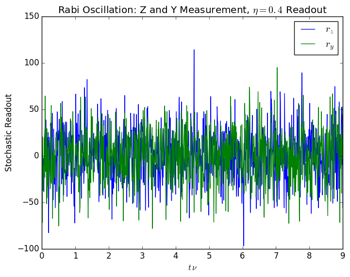
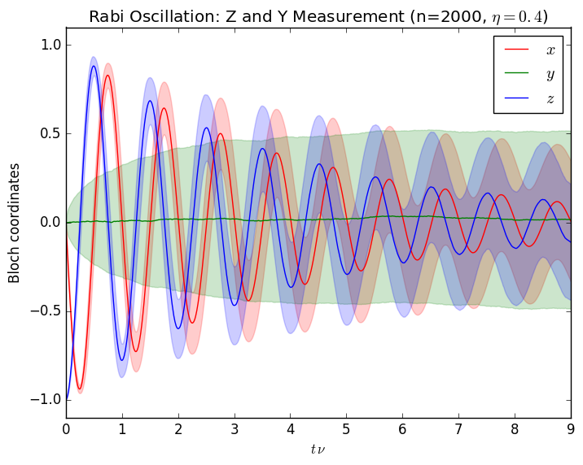
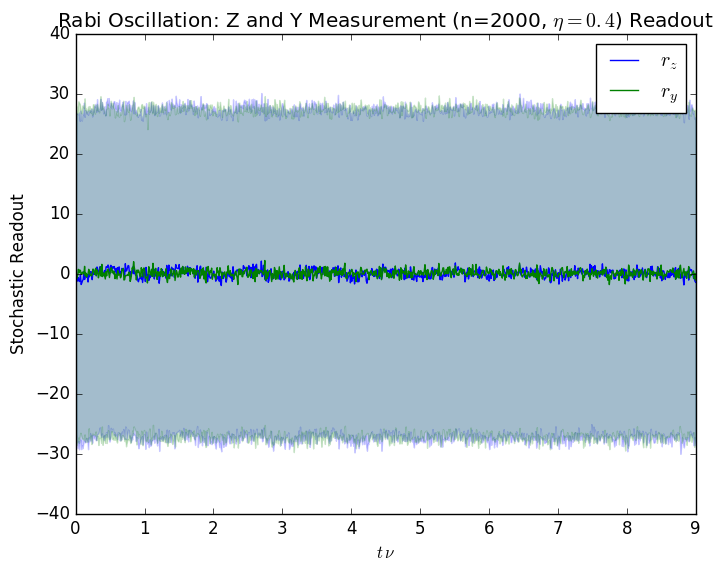

# QuantumBayesian.jl

[](https://travis-ci.org/justindressel/QuantumBayesian)
[](https://ci.appveyor.com/project/justindressel/quantumbayesian)
[](https://codecov.io/gh/justindressel/QuantumBayesian)
[](https://zenodo.org/badge/latestdoi/74835141)

Julia package for simulating quantum evolution efficiently, including the quantum Bayesian approach to stochastic measurement update and continuous readout. The package handles tensor products between arbitrary d-dimensional Hilbert space factors (including partial trace).

The package uses an efficient (sparse) matrix backend, with minimal structural overhead and a lightweight interface. By using proper completely positive maps to simulate time evolution, the package avoids common pitfalls when simulating (stochastic) differential equations for quantum systems. This technique guarantees that a physically sensible state is produced during the evolution, with time-step size affecting only solution precision, and not solution integrity.

See the [notebooks](notebooks) directory for more detailed usage examples.

# Simple Qubit Examples
```julia
using QuantumBayesian
using PyPlot

q = qubit()
```

    QuantumBayesian.QFactor: Qubit
    Dims  : 2
    Ops   : "d", "y", "x", "u", "z", "i"

```julia
Ω  = 2*π;        # Rabi frequency
τ = 3.0;         # Measurement collapse timescale
Γ = 1/(2*τ);     # Measurement dephasing rate
T = (0.0, 6*τ);  # Time duration of simulation;
dt = 1e-2;       # Simulation timestep (coarse to show method precision)

# Initial condition
init = ground(q)

# Time-dependent Hamiltonian
f(t) = 2*exp(-(t-3*τ)^2/2)/sqrt(2π)
H(t) = f(t)*(Ω/2)*q("y");

# Measurement dephasing
DM = sqrt(Γ/2)*q("z");
# Stochastic monitoring (quantum-limited efficiency)
SM = [(q("z"), τ, 1.0)]

# Bloch coordinate expectation values 
fs = collect(ρ -> real(expect(ρ, q(l))) for l in ["x","y","z"])

# Lindblad pulse trajectory (plotting code omitted)
t = trajectory(lind(dt, H, DM), init, T, fs..., dt=dt)
```

    INFO: Trajectory: steps = 1799, points = 1000, values = 3
    INFO: Time elapsed: 0.086969712 s, Steps per second: 20685.362278766657



```julia
# Stochastic pulse trajectory (plotting code omitted)
t = trajectory(meas(dt, H, SM), init, T, fs..., dt=dt)
```

    INFO: Trajectory: steps = 1799, points = 1000, values = 3
    INFO: Readout: values = 1
    INFO: Time elapsed: 0.118673362 s, Steps per second: 15159.257053828136




```julia
# Stochastic pulse ensemble (plotting code omitted)
# No parallelization of ensemble creation
t = ensemble(2500, meas(dt, H, SM), init, T, fs..., dt=dt)
# Mean plotted with Std-Dev shaded behind it
```

    INFO: Trajectories: 2500, steps each: 1799, points each: 1000, values each = 3
    INFO: Readouts: values each = 1
    INFO: Time elapsed: 262.68186513 s, Steps: 2500000, Steps per second: 9517.21581070228





```julia
# Stochastic CW Z-Y measurement (plotting code omitted)
SM = [(q("z"), τ, 0.4), (q("y"), τ, 0.4)]
t = trajectory(meas(dt, H, SM), init, T, fs..., dt=dt)
```

    INFO: Trajectory: steps = 899, points = 899, values = 3
    INFO: Readout: values = 2
    INFO: Time elapsed: 0.081660735 s, Steps per second: 11008.962875487221




```julia
# Stochastic CW Z-Y measurement ensemble (plotting code omitted)
# Parallelization enabled with 4 additional processes
SM = [(q("z"), τ, 0.4), (q("y"), τ, 0.4)]
t = ensemble(2000, meas(dt, H, SM), init, T, fs..., dt=dt)
# Mean plotted with Std-Dev shaded behind it
```

    INFO: Trajectories: 2000, steps each: 899, points each: 899, values each = 3
    INFO: Readouts: values each = 2
    INFO: Time elapsed: 86.065250033 s, Steps: 1798000, Steps per second: 20891.126201464504



